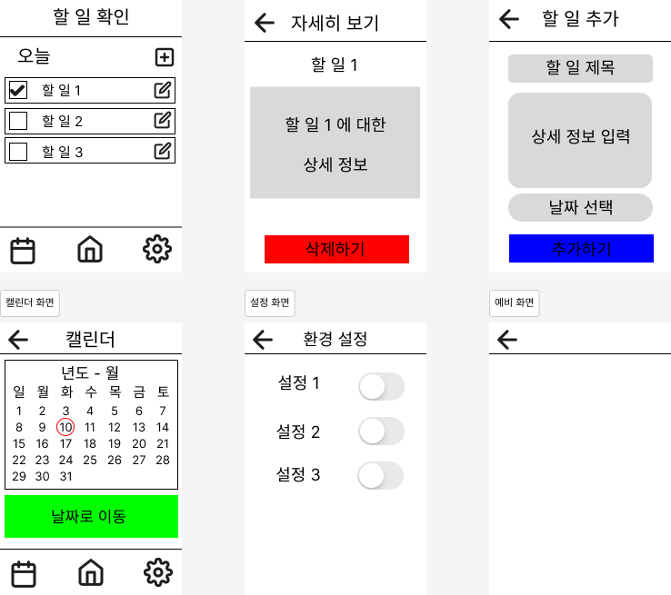

# ✅ 오늘의 할 일 앱 (To-Do App)

Android Studio를 활용해 만든 간단한 할 일 관리 앱입니다.  
할 일을 추가하고, 완료 체크하며, 날짜별로 관리할 수 있는 기능이 포함되어 있습니다.

---

## 📱 주요 기능

- 오늘의 할 일 목록 확인
- 할 일 추가 및 삭제
- 상세 정보 보기
- 날짜 선택 기능 (캘린더)
- 간단한 환경 설정

---

## 🖼️ 화면 예시

앱의 와이어프레임 화면입니다:

---

## 🛠️ 기술 스택

- Android Studio
- Java
- XML 레이아웃
- 기본 Activity 구조

---

> 이 앱은 대학 과제를 위한 실습 프로젝트입니다.

